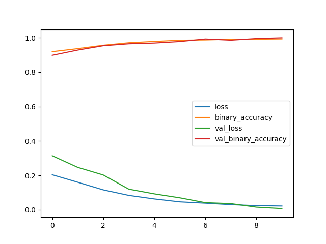
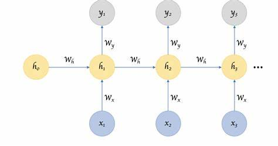

# Youtube Comments Classification : 

## 2-Overview : 

This project aims to classify YouTube comments into several categories, including toxicity, abuse, threats, and more. The classification is performed using Recurrent Neural Networks (RNN) with Long Short-Term Memory (LSTM) cells.

## 3- Dataset : 

 I use [Kaggle](https://www.kaggle.com/datasets/reihanenamdari/youtube-toxicity-data) to train my model 

## 4-Methodology : 

### 1- Data Preprocessing: 

 The comments are preprocessed to remove noise, handle missing values, and tokenize the text.

### 2- Word Embedding: 

 The comments are represented as dense vectors using pre-trained word embeddings or trained alongside the model.

### 3- Model Architecture: 

 Recurrent Neural Networks (RNNs) with Long Short-Term Memory (LSTM) cells are used to learn the sequential patterns in the comments.

### 3- Training:

 The model is trained on the labeled dataset using appropriate loss functions and optimization techniques.

### 4-Evaluation:

 The trained model is evaluated on a separate validation set to measure its performance in classifying YouTube comments.(we use Precesion and Recall to evalute our model (1 Precesion ans Recall = 0.98))

# Usage :

 To use the trained model for comment classification:

1- Clone the repository.
2 -Install the necessary dependencies.
3- Load the trained model weights.
4- Use the model to classify YouTube comments.

# Model Architacture : 

 

# Model Results : 

 

# Information 

# Recurrent Neural Networks (RNNs) and Long Short-Term Memory (LSTM)

## 1- Recurrent Neural Networks (RNNs)

 Recurrent Neural Networks (RNNs) are a class of neural networks designed to work with sequence data, making them particularly well-suited for tasks like natural language processing (NLP), time series analysis, and speech recognition.

 In an RNN, information cycles through a loop, allowing the network to maintain a state or memory of previous inputs. This sequential nature enables RNNs to capture temporal dependencies in the data. However, traditional RNNs can struggle with vanishing or exploding gradients, limiting their ability to learn long-range dependencies.

## 2-Long Short-Term Memory (LSTM) Cells

 Long Short-Term Memory (LSTM) cells are a type of recurrent unit introduced to address the limitations of traditional RNNs. LSTMs are equipped with mechanisms to selectively remember or forget information over time, allowing them to better capture long-term dependencies in sequential data.

